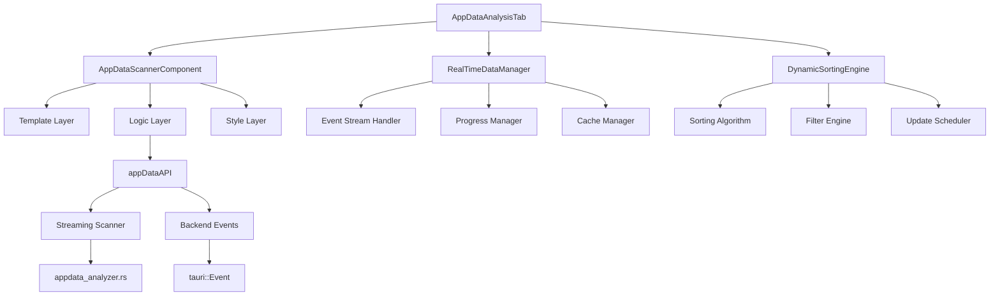

# Design Document

## Overview

前端AppData分析Tab页将采用渐进式架构设计，实现从初始目录结构快速显示到深度扫描分析的完整用户体验。该设计基于现有的AppDataScanner组件架构，通过引入实时数据流、智能缓存机制和动态排序算法，满足用户对AppData空间分析的高效、实时、可视化需求。

## Steering Document Alignment

### Technical Standards (tech.md)
本设计遵循以下技术标准：
- **响应式架构**：采用Vue 3 Composition API和TypeScript，确保类型安全和代码可维护性
- **模块化设计**：遵循单一职责原则，将扫描逻辑、UI组件、数据处理分离到不同模块
- **性能优化**：集成现有的PerformanceOptimizer，限制内存使用在150MB以内，CPU使用率不超过25%
- **错误处理**：采用统一的错误处理机制，提供友好的用户反馈

### Project Structure (structure.md)
设计严格遵循项目结构约定：
- **组件层**：基于现有的AppDataScanner.vue进行扩展，保持组件接口一致性
- **服务层**：复用appDataAPI服务，扩展流式扫描功能
- **类型定义**：沿用src/types/appdata.ts中的接口定义，确保类型兼容性
- **后端集成**：基于现有的appdata_analyzer.rs，增强流式事件推送机制

## Code Reuse Analysis

### Existing Components to Leverage
- **[AppDataScanner.vue]**：作为基础组件，提供扫描控制、结果展示、迁移功能的核心框架
- **[appdata_analyzer.rs]**：复用现有的AppDataAnalyzer结构体，扩展流式扫描能力
- **[appDataAPI]**：基于现有的API服务，增强实时事件处理和进度报告功能
- **[PerformanceOptimizer]**：集成现有的性能优化器，确保扫描过程的资源控制

### Integration Points
- **[Tauri Event System]**：利用Tauri的事件系统实现前后端实时通信
- **[Element Plus Components]**：复用现有的UI组件库，保持一致的用户体验
- **[TypeScript Interfaces]**：沿用现有的类型定义，确保数据流的一致性
- **[Error Recovery System]**：集成现有的错误恢复机制，提高系统可靠性

## Architecture

本设计采用分层架构模式，实现关注点分离和模块化设计：



### Modular Design Principles
- **Single File Responsibility**：每个文件处理特定的功能域
  - `AppDataAnalysisTab.vue`：主组件，负责整体协调
  - `RealTimeDataManager.ts`：实时数据流管理
  - `DynamicSortingEngine.ts`：动态排序算法实现
  - `StreamingScanner.rs`：后端流式扫描服务

- **Component Isolation**：创建小型、专注的组件
  - 分离扫描控制、进度显示、结果展示为独立子组件
  - 使用Props和Events进行组件间通信
  - 避免大型单体组件，提高可测试性

- **Service Layer Separation**：分离数据访问、业务逻辑和展示层
  - API服务层：处理与后端的通信
  - 业务逻辑层：处理数据转换和业务规则
  - 展示层：专注于UI渲染和用户交互

- **Utility Modularity**：将工具函数分解为单一用途模块
  - 格式化工具：文件大小、时间等格式化
  - 排序工具：各种排序算法的实现
  - 缓存工具：数据缓存和清理机制

## Components and Interfaces

### Component 1: AppDataAnalysisTab
- **Purpose**: 主组件，协调整个AppData分析流程，提供统一的用户界面
- **Interfaces**: 
  - `startInitialScan()`: 启动初始目录结构扫描
  - `startDeepScan()`: 启动深度扫描进程
  - `updateSortOrder(field, order)`: 更新排序设置
  - `getScanProgress()`: 获取当前扫描进度
- **Dependencies**: RealTimeDataManager, DynamicSortingEngine, Element Plus组件库
- **Reuses**: 基于现有的AppDataScanner组件架构，扩展实时数据处理能力

### Component 2: RealTimeDataManager
- **Purpose**: 管理实时数据流，处理后端事件推送，维护数据一致性
- **Interfaces**:
  - `subscribeToEvents(callback)`: 订阅扫描事件
  - `updateItemSize(path, size)`: 更新项目大小
  - `getCurrentData()`: 获取当前数据快照
  - `clearCache()`: 清理数据缓存
- **Dependencies**: appDataAPI服务，Tauri事件系统
- **Reuses**: 复用现有的API调用模式，扩展事件监听机制

### Component 3: DynamicSortingEngine
- **Purpose**: 实现动态排序算法，根据扫描进度实时调整项目顺序
- **Interfaces**:
  - `sortItems(items, field, order)`: 对项目列表进行排序
  - `updateSortField(field)`: 更新排序字段
  - `getSortOrder()`: 获取当前排序设置
  - `scheduleSortUpdate(delay)`: 调度排序更新
- **Dependencies**: 纯算法组件，无外部依赖
- **Reuses**: 基于现有的排序逻辑，优化为增量更新模式

### Component 4: StreamingScanner (Backend)
- **Purpose**: 后端流式扫描服务，支持并发扫描和实时事件推送
- **Interfaces**:
  - `scan_appdata_streaming(config)`: 启动流式扫描
  - `send_scan_event(event)`: 发送扫描事件
  - `handle_scan_error(error)`: 处理扫描错误
  - `get_scan_statistics()`: 获取扫描统计信息
- **Dependencies**: tokio异步运行时，mpsc通道，Tauri事件系统
- **Reuses**: 基于现有的AppDataAnalyzer，扩展并发和事件推送能力

## Data Models

### Model 1: RealTimeScanData
```typescript
interface RealTimeScanData {
  items: AppDataFirstLevelItem[];           // 当前项目列表
  totalSize: number;                        // 总大小
  scanProgress: number;                     // 扫描进度 (0-100)
  lastUpdateTime: number;                   // 最后更新时间戳
  isScanning: boolean;                      // 是否正在扫描
  sortField: 'name' | 'size';              // 当前排序字段
  sortOrder: 'asc' | 'desc';               // 当前排序方式
  errorCount: number;                       // 错误计数
  cacheHitRate: number;                     // 缓存命中率
}
```

### Model 2: ScanEvent
```rust
#[derive(Debug, Clone, Serialize, Deserialize)]
pub enum ScanEvent {
    DirectoryStarted { 
        name: String, 
        path: String,
        timestamp: u64 
    },
    ItemFound { 
        item: AppDataFirstLevelItem,
        scan_progress: f64 
    },
    ItemUpdated {
        path: String,
        new_size: u64,
        update_reason: String
    },
    DirectoryCompleted { 
        name: String, 
        item_count: usize, 
        total_size: u64,
        scan_time_ms: u64 
    },
    ScanProgress { 
        percentage: f64, 
        current_path: String, 
        items_found: usize,
        estimated_time_remaining: Option<u64>
    },
    ScanCompleted { 
        total_items: usize, 
        total_size: u64, 
        scan_time_ms: u64,
        cache_statistics: CacheStats
    },
    ScanError { 
        error: String, 
        path: String,
        error_type: String,
        recoverable: bool 
    },
}
```

### Model 3: CacheStatistics
```typescript
interface CacheStatistics {
  hitCount: number;                         // 缓存命中次数
  missCount: number;                        // 缓存未命中次数
  evictionCount: number;                    // 缓存淘汰次数
  memoryUsage: number;                      // 内存使用量 (MB)
  cleanupCount: number;                     // 清理次数
  lastCleanupTime: number;                  // 最后清理时间
}
```

## Error Handling

### Error Scenario 1: 扫描权限不足
- **Handling**: 捕获权限错误，记录详细错误信息，跳过受限制的项目继续扫描其他内容
- **User Impact**: 显示友好的提示信息："部分目录需要管理员权限，已跳过这些项目继续扫描"

### Error Scenario 2: 内存使用超限
- **Handling**: 监控内存使用情况，当接近150MB限制时自动触发缓存清理和数据压缩
- **User Impact**: 显示内存优化提示："正在进行内存优化，扫描速度可能暂时降低"

### Error Scenario 3: 网络驱动器访问超时
- **Handling**: 设置合理的超时时间（5秒），超时后标记为不可用并继续扫描其他项目
- **User Impact**: 显示超时提示："网络驱动器访问超时，已跳过该项目"

### Error Scenario 4: 排序算法性能瓶颈
- **Handling**: 对于大数据集（>1000个项目），采用分批排序和增量更新策略
- **User Impact**: 无感知，后台自动优化排序性能，保持UI响应性

### Error Scenario 5: 事件流中断
- **Handling**: 实现事件流断线重连机制，缓存已扫描数据，恢复后继续扫描
- **User Impact**: 显示重连提示："连接已恢复，继续扫描中..."

## Testing Strategy

### Unit Testing
- **组件单元测试**：测试各个Vue组件的渲染逻辑、事件处理、Props验证
- **算法单元测试**：测试排序算法、缓存策略、数据转换函数的正确性
- **API服务测试**：模拟后端响应，测试API调用的错误处理和重试机制
- **工具函数测试**：测试格式化、计算、验证等工具函数的各种边界情况

### Integration Testing
- **前后端集成测试**：验证流式事件推送、数据同步、错误处理的完整性
- **组件集成测试**：测试主组件与子组件之间的数据流和事件传递
- **服务集成测试**：测试RealTimeDataManager与appDataAPI的协同工作
- **缓存集成测试**：验证缓存策略与数据一致性保证机制

### End-to-End Testing
- **完整用户流程测试**：从打开Tab页到扫描完成的完整用户体验路径
- **性能基准测试**：验证在各种数据规模下的响应时间和资源使用
- **错误恢复测试**：模拟各种错误场景，验证系统的恢复能力
- **多用户并发测试**：测试系统在并发访问情况下的稳定性
- **边界条件测试**：测试空目录、超大文件、深度嵌套等极端情况