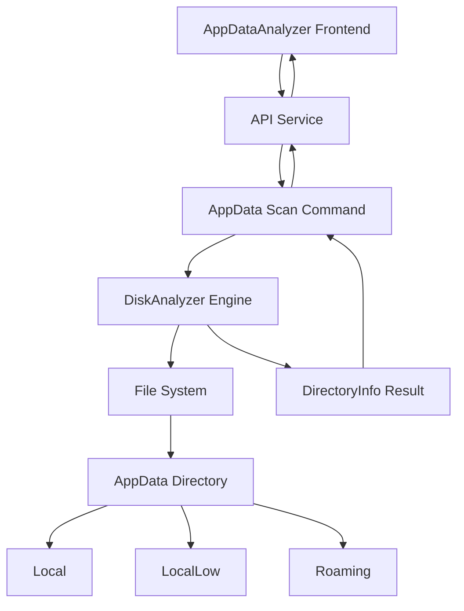

# AppData Focused Analyzer - Design

## Overview
设计一个专门针对Windows用户AppData目录的空间分析工具，通过重用现有的磁盘分析引擎，提供简化的用户界面和聚焦的功能体验。该工具将自动检测当前用户的AppData目录，扫描AppData\Local、AppData\LocalLow、AppData\Roaming三个关键子目录下的一级子目录及文件，按大小动态逆序排序，最终只显示1GB以上的项目作为迁移目标。用户可通过选择目标盘符进行文件迁移。

## Steering Document Alignment

### Technical Standards (tech.md)
- **技术栈一致性**: 继续使用Rust + Tauri + Vue 3 + TypeScript技术栈
- **性能要求**: 扫描时间 < 30秒，内存占用 < 150MB，符合性能优先原则
- **架构模式**: 保持前后端分离架构，使用Tauri的IPC通信机制
- **代码规范**: 遵循现有的命名约定和代码结构模式

### Project Structure (structure.md)
- **模块化设计**: 创建独立的AppData分析模块，遵循单一职责原则
- **文件命名**: 使用snake_case命名Rust模块，PascalCase命名Vue组件
- **目录结构**: 在现有结构中新增专用模块，保持项目组织一致性

## Code Reuse Analysis

### Existing Components to Leverage
- **[DiskAnalyzer]**: 重用现有的磁盘扫描引擎，通过配置参数适配AppData扫描需求
- **[DirectoryInfo]**: 使用现有的目录信息结构体，无需重新定义数据模型
- **[format_file_size]**: 复用文件大小格式化工具函数
- **[ScanProgress]**: 重用扫描进度管理功能
- **[DirectoryTree.vue]**: 基于现有目录树组件构建新的AppData展示界面

### Integration Points
- **[Tauri Commands]**: 扩展现有的命令系统，添加AppData专用扫描命令
- **[API Service]**: 在现有API服务中添加AppData分析方法
- **[Error Handling]**: 集成现有的错误处理和恢复机制
- **[Performance Monitoring]**: 复用性能监控和优化功能

## Architecture

### Modular Design Principles
- **单一职责**: AppDataAnalyzer只负责AppData目录的扫描和分析
- **组件隔离**: 创建独立的Vue组件处理AppData展示逻辑
- **服务层分离**: 前后端通过清晰的API接口通信
- **配置驱动**: 通过参数配置控制扫描行为，而非硬编码



## Components and Interfaces

### AppDataAnalyzer (Rust Backend)
- **Purpose**: 专门处理AppData目录扫描的核心分析器
- **Interfaces**:
  - `scan_appdata_directory()`: 扫描当前用户AppData目录
  - `get_appdata_path()`: 获取当前用户AppData路径
  - `filter_large_folders()`: 筛选1GB以上文件夹
  - `get_first_level_items()`: 获取三个主要目录下的一级子目录和文件
  - `sort_by_size_dynamic()`: 动态按大小排序
- **Dependencies**: DiskAnalyzer, std::env, std::path
- **Reuses**: 现有DiskAnalyzer的扫描逻辑和进度管理

### AppDataScanner (Vue Frontend Component)
- **Purpose**: 提供AppData扫描的用户界面和交互
- **Interfaces**:
  - `startAppDataScan()`: 启动AppData扫描
  - `displayResults()`: 显示扫描结果
  - `sortBySize()`: 按大小排序功能
  - `selectTargetDrive()`: 选择目标盘符
  - `migrateSelectedItems()`: 迁移选中的大文件
- **Dependencies**: Element Plus组件库, API Service
- **Reuses**: 现有的文件大小格式化函数和加载状态管理

### AppDataService (Frontend Service)
- **Purpose**: 封装AppData相关的API调用
- **Interfaces**:
  - `scanAppData()`: 调用后端AppData扫描
  - `getAppDataInfo()`: 获取AppData目录信息
- **Dependencies**: Tauri的invoke API
- **Reuses**: 现有的错误处理和响应封装机制

## Data Models

### AppDataInfo
```
{
  "local_path": string,        // AppData\Local路径
  "local_low_path": string,    // AppData\LocalLow路径
  "roaming_path": string,      // AppData\Roaming路径
  "local_size": number,        // Local目录总大小
  "local_low_size": number,    // LocalLow目录总大小
  "roaming_size": number,      // Roaming目录总大小
  "total_size": number,        // 总大小（字节）
  "first_level_items": AppDataFirstLevelItem[], // 三个目录下的一级子目录和文件
  "large_items": DirectoryInfo[], // 1GB以上项目列表
  "scan_time_ms": number       // 扫描耗时（毫秒）
}
```

### AppDataFirstLevelItem
```
{
  "path": string,              // 完整路径
  "name": string,              // 名称
  "size": number,              // 大小（字节）
  "type": "directory" | "file", // 类型
  "parent_type": "Local" | "LocalLow" | "Roaming", // 父目录类型
  "is_large": boolean,         // 是否大于1GB
  "size_percentage": number    // 占总大小百分比
}
```

### AppDataScanOptions
```
{
  "min_size_threshold": number,    // 最小大小阈值（默认1GB）
  "max_depth": number,            // 最大扫描深度（默认2层）
  "sort_order": "asc" | "desc",   // 排序方式（默认desc）
  "show_only_large": boolean      // 是否只显示大文件（默认true）
}
```

### AppDataMigrationOptions
```
{
  "source_items": string[],      // 要迁移的项目路径列表
  "target_drive": string,       // 目标盘符（如"D:"）
  "create_symlink": boolean,    // 是否创建符号链接
  "delete_source": boolean      // 是否删除源文件
}
```

## Error Handling

### Error Scenario 1: AppData路径检测失败
- **Handling**: 回退到默认Windows用户目录结构，尝试手动构建AppData路径
- **User Impact**: 显示友好的错误提示，建议用户手动选择目录

### Error Scenario 2: 权限不足无法访问AppData
- **Handling**: 捕获权限错误，跳过无法访问的子目录，继续扫描其他部分
- **User Impact**: 显示部分扫描结果，提示某些目录因权限问题被跳过

### Error Scenario 3: AppData目录不存在
- **Handling**: 验证路径存在性，如不存在则提示用户确认系统环境
- **User Impact**: 显示错误信息，建议检查系统配置或手动指定目录

### Error Scenario 4: 目标盘符空间不足
- **Handling**: 检查目标盘符可用空间，如不足则提示用户选择其他盘符
- **User Impact**: 显示空间不足错误，提供可用盘符列表

### Error Scenario 5: 迁移过程中断
- **Handling**: 使用错误恢复机制，支持迁移中断后的恢复操作
- **User Impact**: 显示迁移中断提示，提供重试选项

## Testing Strategy

### Unit Testing
- **AppData路径检测**: 测试不同Windows版本下的路径解析
- **大小过滤逻辑**: 验证1GB阈值过滤的准确性
- **排序算法**: 测试按大小逆序排序的正确性

### Integration Testing
- **完整扫描流程**: 测试从路径检测到结果展示的完整流程
- **错误处理**: 验证各种错误情况的处理和恢复
- **性能基准**: 确保扫描时间在30秒内完成

### End-to-End Testing
- **用户交互流程**: 模拟用户启动扫描、查看结果的操作流程
- **界面响应**: 验证界面在扫描过程中的响应性和状态更新
- **数据准确性**: 对比系统实际文件大小验证计算准确性