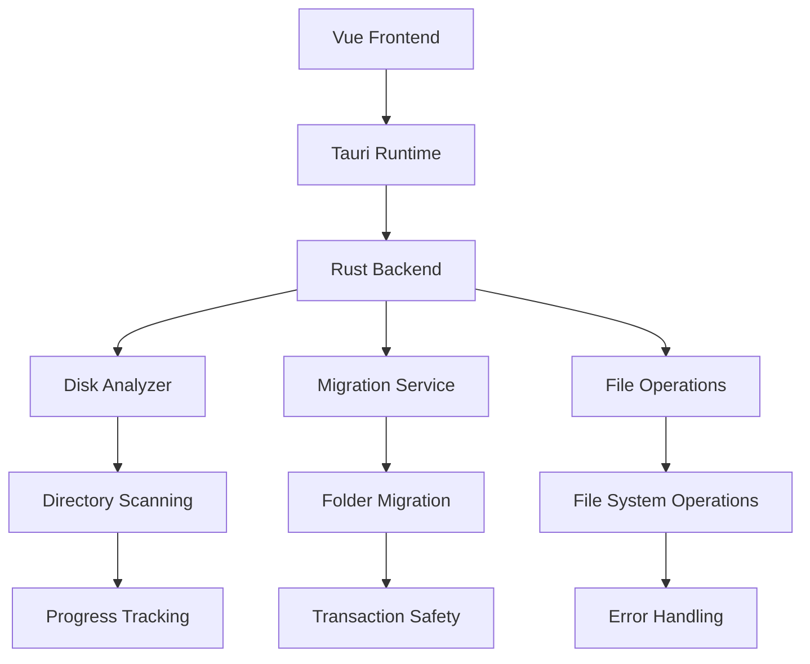

# Design Document

## Overview

C盘空间管理工具是一个基于 Tauri + Rust + Vue + TypeScript 技术栈的桌面应用程序，提供磁盘空间分析和文件夹迁移功能。该设计基于现有架构，充分利用已实现的组件和功能，同时扩展必要的特性以满足用户需求。

## Steering Document Alignment

### Technical Standards (tech.md)
- **技术栈一致性**: 继续使用 Tauri + Rust 后端和 Vue + TypeScript 前端
- **模块化架构**: 保持现有的模块化设计，每个模块专注单一职责
- **异步处理**: 延续异步扫描和迁移操作模式
- **错误处理**: 保持完善的错误处理和用户反馈机制

### Project Structure (structure.md)
- **前后端分离**: 保持 `src-tauri/` 和 `src/` 的清晰分离
- **组件化前端**: 继续使用 Vue 单文件组件模式
- **服务层抽象**: 维持 API 服务层的抽象封装
- **类型安全**: 保持 TypeScript 和 Rust 的类型安全设计

## Code Reuse Analysis

### Existing Components to Leverage
- **DiskAnalyzer**: 现有的磁盘扫描引擎，支持异步操作和进度跟踪
- **MigrationService**: 完整的文件夹迁移服务，包含验证、复制、验证流程
- **FileOperator**: 安全的文件操作系统，支持复制、删除、符号链接创建
- **DirectoryTree.vue**: 功能完整的目录树展示组件，支持排序、过滤、右键菜单
- **api.ts**: 完善的 API 封装层，提供类型安全的后端调用

### Integration Points
- **Tauri Commands**: 通过现有的 Tauri 命令系统 (`scan_directory`, `migrate_directory` 等)
- **Element Plus**: 继续使用 Element Plus UI 组件库保持一致性
- **状态管理**: 利用 Vue 的响应式系统和组件状态管理
- **日志系统**: 集成现有的日志记录机制

## Architecture

系统采用分层架构设计，保持现有结构的同时进行功能增强：



### Modular Design Principles
- **Single File Responsibility**: 每个模块处理特定的业务逻辑
- **Component Isolation**: UI 组件保持独立和可重用
- **Service Layer Separation**: API 服务层与业务逻辑分离
- **Utility Modularity**: 工具函数按功能分类组织

## Components and Interfaces

### Enhanced Disk Analyzer Component
- **Purpose**: 提供增强的磁盘扫描功能，支持C盘专项分析
- **Interfaces**: 
  - `scan_directory(path: string): Promise<DirectoryInfo>`
  - `get_scan_progress(): Promise<ScanProgress>`
  - `stop_scan(): Promise<void>`
- **Dependencies**: 文件系统访问，进度跟踪
- **Reuses**: 现有的 `DiskAnalyzer` 结构，添加C盘优化

### Migration Dialog Enhancement
- **Purpose**: 提供用户友好的文件夹迁移界面
- **Interfaces**:
  - `show_migration_dialog(directory: DirectoryInfo): void`
  - `validate_migration_path(source: string, target: string): Promise<ValidationResult>`
- **Dependencies**: 迁移服务API，路径验证
- **Reuses**: 现有的 `MigrationDialog.vue` 组件

### Progress Monitoring System
- **Purpose**: 实时监控扫描和迁移进度
- **Interfaces**:
  - `start_progress_monitoring(operation: string): void`
  - `update_progress(percentage: number, status: string): void`
- **Dependencies**: 事件系统，UI状态管理
- **Reuses**: 现有的进度跟踪机制

### Context Menu System
- **Purpose**: 提供右键菜单进行快速操作
- **Interfaces**:
  - `show_context_menu(event: MouseEvent, directory: DirectoryInfo): void`
  - `handle_migration_request(directory: DirectoryInfo): void`
- **Dependencies**: 鼠标事件处理，菜单定位
- **Reuses**: 现有的 `ContextMenu.vue` 组件

## Data Models

### Enhanced DirectoryInfo
```
DirectoryInfo {
  path: string
  name: string
  size: number
  file_count: number
  subdirectories: DirectoryInfo[]
  last_modified?: Date
  is_large_folder?: boolean  // 新增：标识大文件夹
  size_percentage?: number   // 新增：相对父目录的占比
}
```

### MigrationProgress
```
MigrationProgress {
  operation: string
  current_item: string
  processed: number
  total: number
  percentage: number
  status: 'running' | 'completed' | 'failed' | 'cancelled'
  estimated_time?: number    // 新增：预计剩余时间
}
```

### DiskSpaceInfo
```
DiskSpaceInfo {
  drive: string
  total_space: number
  free_space: number
  used_space: number
  usage_percentage: number
  large_folders: DirectoryInfo[]  // 新增：占用空间最多的文件夹
}
```

## Error Handling

### Enhanced Error Scenarios
1. **权限不足**
   - **Handling**: 捕获权限错误，提供管理员权限请求指引
   - **User Impact**: 显示友好的错误提示和操作指导

2. **磁盘空间不足**
   - **Handling**: 预检查可用空间，提供空间清理建议
   - **User Impact**: 显示空间需求和建议的清理操作

3. **文件锁定/占用**
   - **Handling**: 检测文件锁定状态，提供重试机制
   - **User Impact**: 显示哪些文件被占用，提供跳过选项

4. **网络驱动器访问失败**
   - **Handling**: 检测网络连接状态，提供离线模式
   - **User Impact**: 显示网络状态，建议检查网络连接

### Recovery Mechanisms
- **自动重试**: 对临时性错误进行自动重试
- **部分回滚**: 迁移失败时自动清理已复制文件
- **操作日志**: 详细记录所有操作，支持故障恢复
- **备份机制**: 重要操作前创建自动备份点

## Testing Strategy

### Unit Testing
- **Disk Analyzer**: 测试扫描算法、进度计算、错误处理
- **Migration Service**: 测试迁移逻辑、验证机制、回滚功能
- **File Operations**: 测试文件复制、删除、符号链接创建
- **UI Components**: 测试组件渲染、事件处理、状态管理

### Integration Testing
- **端到端迁移流程**: 测试完整的迁移流程
- **扫描-迁移集成**: 测试扫描后迁移的连贯性
- **错误恢复测试**: 测试各种错误情况下的恢复机制
- **性能测试**: 测试大文件夹处理的性能表现

### End-to-End Testing
- **用户操作流程**: 模拟真实用户的完整操作流程
- **多场景测试**: 测试不同文件夹结构和大小的情况
- **边界条件**: 测试空文件夹、超大文件夹等边界情况
- **并发操作**: 测试多任务同时执行的情况

## Performance Optimization

### Scanning Performance
- **异步处理**: 继续使用异步扫描避免UI阻塞
- **增量更新**: 实现增量扫描，只更新变化的部分
- **缓存机制**: 缓存常用目录信息，减少重复扫描
- **深度控制**: 提供扫描深度控制，避免过深扫描

### Migration Performance
- **批量操作**: 批量处理小文件，减少系统调用
- **进度缓冲**: 实现进度更新缓冲，避免频繁UI更新
- **内存管理**: 优化内存使用，处理大文件夹时避免内存溢出
- **断点续传**: 支持迁移中断后的断点续传功能

## Security Considerations

### Path Validation
- **路径遍历防护**: 严格验证用户输入的路径
- **符号链接检查**: 防止通过符号链接访问受限区域
- **权限验证**: 操作前验证用户权限
- **沙箱限制**: 在Tauri的沙箱环境中运行

### Data Protection
- **操作确认**: 重要操作需要用户明确确认
- **备份机制**: 迁移操作前创建数据备份
- **日志审计**: 记录所有文件操作用于审计
- **错误隔离**: 防止错误操作影响系统稳定性