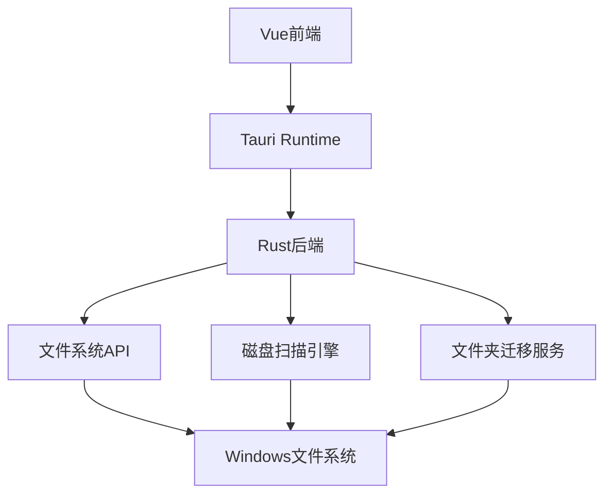

# C盘空间管理工具架构设计

## 项目概述
基于 Tauri + Rust + Vue + TypeScript + Element Plus 技术栈开发的 C 盘空间管理工具，实现类似 WinDirStat 的存储空间分析和文件夹迁移功能。

## 技术栈
- **前端**: Vue 3 + TypeScript + Element Plus + Vite
- **后端**: Rust + Tauri
- **构建工具**: Vite + Tauri CLI
- **包管理**: pnpm

## 系统架构

### 整体架构图


### 前端架构
```
src/
├── components/
│   ├── DirectoryTree.vue      # 目录树展示组件
│   ├── SpaceVisualization.vue # 空间可视化组件
│   ├── MigrationDialog.vue    # 迁移对话框组件
│   └── ContextMenu.vue        # 右键菜单组件
├── services/
│   └── api.ts                 # 后端API接口封装
├── types/
│   └── directory.ts           # TypeScript类型定义
├── App.vue                    # 主应用组件
└── main.ts                    # 应用入口
```

### 后端架构
```
src-tauri/src/
├── lib.rs                     # 主库文件，定义Tauri命令
├── disk_analyzer.rs          # 磁盘空间分析模块
├── file_operations.rs        # 文件操作模块
├── migration_service.rs      # 文件夹迁移服务模块
└── types.rs                  # Rust数据结构定义
```

## 核心功能模块

### 1. 磁盘空间分析模块 (disk_analyzer.rs)
- 递归扫描目录结构
- 计算文件夹大小
- 异步处理大目录
- 实时进度反馈

### 2. 文件操作模块 (file_operations.rs)
- 安全的文件复制
- 原子性删除操作
- 符号链接创建
- 错误处理和回滚机制

### 3. 迁移服务模块 (migration_service.rs)
- 完整的迁移流程控制
- 事务性操作保证
- 权限管理
- 备份和恢复机制

### 4. 前端可视化组件
- 树形表格展示目录结构
- 进度条显示空间占用比例
- 右键菜单交互
- 排序和筛选功能

## 关键技术实现

### 磁盘扫描算法
```rust
pub async fn scan_directory(path: &Path) -> Result<DirectoryInfo, Error> {
    let mut total_size = 0u64;
    let mut subdirectories = Vec::new();
    
    // 异步读取目录条目
    let mut entries = tokio::fs::read_dir(path).await?;
    
    while let Some(entry) = entries.next_entry().await? {
        let path = entry.path();
        
        if path.is_dir() {
            // 递归扫描子目录
            let dir_info = scan_directory(&path).await?;
            total_size += dir_info.size;
            subdirectories.push(dir_info);
        } else {
            // 累加文件大小
            let metadata = entry.metadata().await?;
            total_size += metadata.len();
        }
    }
    
    Ok(DirectoryInfo {
        path: path.to_path_buf(),
        size: total_size,
        subdirectories,
        file_count: 0,
    })
}
```

### 文件夹迁移流程
1. **预检查**: 验证源路径、目标路径、磁盘空间
2. **复制阶段**: 递归复制文件夹内容
3. **验证阶段**: 确认复制完整性
4. **删除阶段**: 安全删除原文件夹
5. **链接阶段**: 创建符号链接
6. **清理阶段**: 处理临时文件

### 前端API接口
```typescript
// services/api.ts
export const api = {
  // 扫描磁盘
  async scanDirectory(path: string): Promise<DirectoryInfo> {
    return await invoke('scan_directory', { path });
  },
  
  // 迁移文件夹
  async migrateDirectory(source: string, target: string): Promise<boolean> {
    return await invoke('migrate_directory', { source, target });
  },
  
  // 获取扫描进度
  async getScanProgress(): Promise<number> {
    return await invoke('get_scan_progress');
  }
};
```

## 性能优化策略

### 1. 扫描性能优化
- 使用异步I/O操作
- 实现并发扫描控制
- 添加扫描进度反馈
- 缓存常用目录信息

### 2. 内存使用优化
- 流式处理大目录
- 及时释放不需要的内存
- 使用迭代器而非收集所有数据

### 3. UI响应优化
- 虚拟滚动处理大量数据
- 分页加载子目录
- 防抖处理用户操作

## 错误处理和安全性

### 1. 错误处理机制
- 操作失败自动回滚
- 详细的错误信息记录
- 用户友好的错误提示
- 异常情况的恢复策略

### 2. 安全性考虑
- 路径遍历攻击防护
- 权限检查和请求
- 操作确认对话框
- 重要操作的可撤销性

### 3. 数据完整性
- 文件复制验证
- 操作日志记录
- 备份机制
- 一致性检查

## 权限配置

### Tauri 权限配置
```json
{
  "permissions": [
    "filesystem:read-all",
    "filesystem:write-all",
    "dialog:open",
    "dialog:save",
    "shell:allow-execute"
  ]
}
```

## 部署和构建

### 开发环境
```bash
# 安装依赖
pnpm install

# 开发模式
pnpm tauri dev
```

### 生产构建
```bash
# 构建应用
pnpm tauri build
```

## 后续扩展计划

1. **多磁盘支持**: 扩展到其他磁盘分区
2. **文件类型分析**: 按文件类型统计空间占用
3. **定时清理**: 自动清理临时文件和缓存
4. **网络驱动器**: 支持网络位置的空间分析
5. **数据导出**: 导出分析报告为各种格式

这个架构设计提供了完整的 C 盘空间管理解决方案，具备良好的扩展性和可维护性。